# 蒸汽时代

> 本章共收录 **20** 台机器/部件。（另有 1 条信息待补充条目见 [17-待完善条目](17-待完善条目.md)）

## 目录
- [大型蒸汽储罐](#大型蒸汽储罐)
- [大型蒸汽太阳能锅炉](#大型蒸汽太阳能锅炉)
- [大型蒸汽搅拌机](#大型蒸汽搅拌机)
- [大型蒸汽洗矿机](#大型蒸汽洗矿机)
- [大型蒸汽浸洗机](#大型蒸汽浸洗机)
- [大型蒸汽熔炉](#大型蒸汽熔炉)
- [大型蒸汽电路组装机](#大型蒸汽电路组装机)
- [大型蒸汽研磨机](#大型蒸汽研磨机)
- [大型蒸汽破碎机](#大型蒸汽破碎机)
- [大型蒸汽离心机](#大型蒸汽离心机)
- [大型蒸汽锻造锤](#大型蒸汽锻造锤)
- [蒸汽分离机](#蒸汽分离机)
- [蒸汽挤压机](#蒸汽挤压机)
- [蒸汽搅拌机](#蒸汽搅拌机)
- [蒸汽洗矿机](#蒸汽洗矿机)
- [蒸汽活塞锤](#蒸汽活塞锤)
- [蒸汽浸洗机](#蒸汽浸洗机)
- [蒸汽破碎机](#蒸汽破碎机)
- [蒸汽裂化机](#蒸汽裂化机)
- [蒸汽铸造炉](#蒸汽铸造炉)

---

### 大型蒸汽储罐

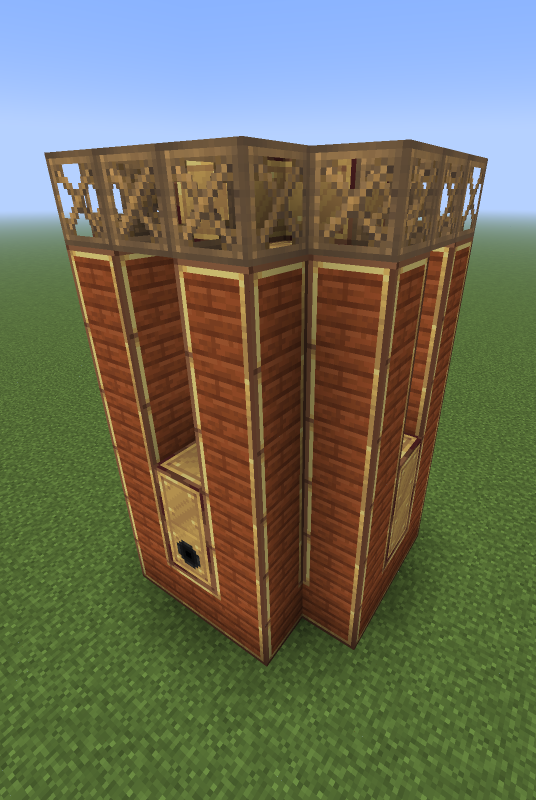

- **配方类型**: 占位
- **功能**: 储存

**相关任务**

- [lv] 你最想要的缓存: 这个大家伙的输入和输出都只能通过钢制储罐阀门来进行。

---

### 大型蒸汽太阳能锅炉

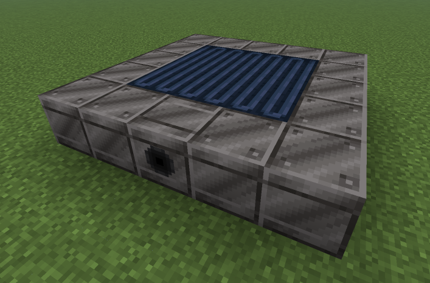

- **配方类型**: 占位 （实际为生产蒸汽）

**仓室要求**

- 流体输出(1倍)（必需）
- 流体输入(1倍)（必需）

---

### 大型蒸汽搅拌机

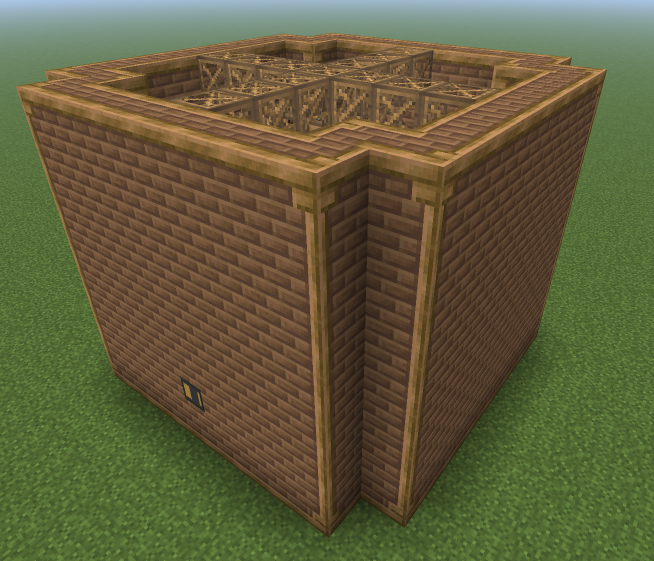

- **配方类型**: 搅拌

**仓室要求**

- 蒸汽输入 1 个（必需）
- 蒸汽物品输入 1 个（必需）
- 蒸汽物品输出 1 个（必需）
- 物品输入 1-4 个（必需）
- 物品输出 1 个（必需）

---

### 大型蒸汽洗矿机

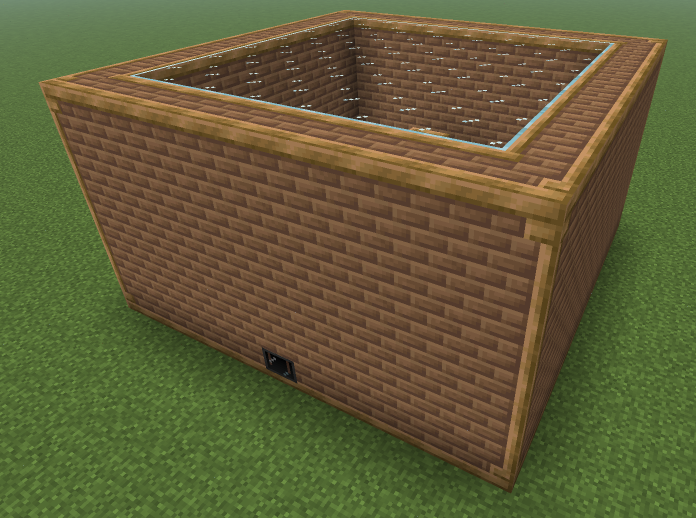

- **配方类型**: 洗矿

**仓室要求**

- 蒸汽输入 1 个（必需）
- 蒸汽物品输入 1 个（必需）
- 蒸汽物品输出 1 个（必需）
- 蒸汽流体输入 最多 1 个（可选）
- 流体输入 最多 1 个（可选）
- 物品输入 1 个（必需）
- 物品输出 1-3 个（必需）

---

### 大型蒸汽浸洗机

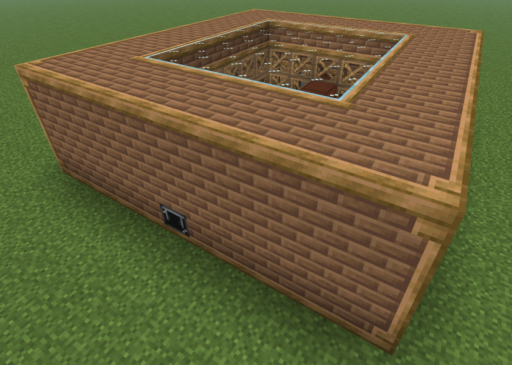

- **配方类型**: 化学浸洗

**仓室要求**

- 蒸汽输入 1 个（必需）
- 蒸汽物品输入 1 个（必需）
- 蒸汽物品输出 1 个（必需）
- 蒸汽流体输入 最多 1 个（可选）
- 流体输入 最多 1 个（可选）
- 物品输入 1 个（必需）
- 物品输出 1-3 个（必需）

---

### 大型蒸汽熔炉

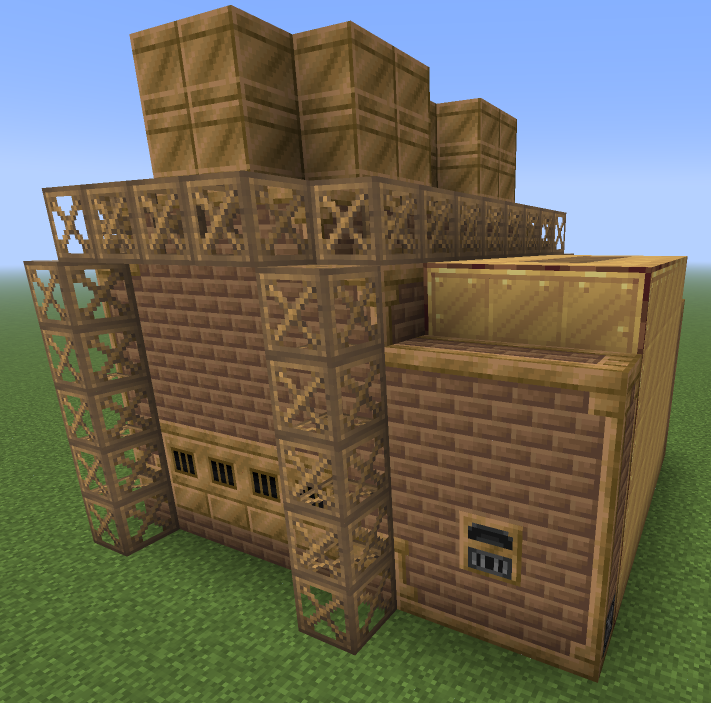

- **配方类型**: 熔炉

**仓室要求**

- 蒸汽输入 1 个（必需）
- 蒸汽物品输入 1 个（必需）
- 蒸汽物品输出 1 个（必需）
- 物品输入 1 个（必需）
- 物品输出 1 个（必需）

---

### 大型蒸汽电路组装机

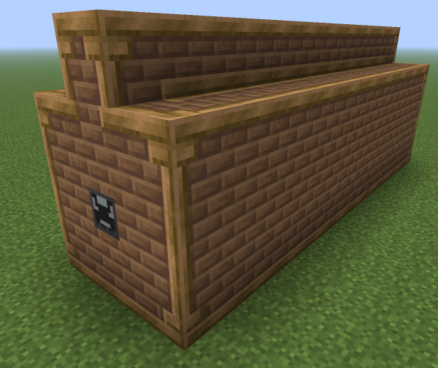

- **配方类型**: 电路组装

**仓室要求**

- 蒸汽输入 1 个（必需）
- 维护仓 1 个（必需）
- 蒸汽物品输入 1 个（必需）
- 蒸汽物品输出 1 个（必需）
- 蒸汽流体输入 最多 1 个（可选）
- 流体输入 最多 1 个（可选）
- 物品输入 1-2 个（必需）
- 物品输出 1 个（必需）

**相关任务**

  - [ae] 记得插加速卡: 配合样板供应器进行自动化合成，虽然在MV阶段你就可以制造它，但你至少需要达到HV阶段才可以建立自动合成系统

---

### 大型蒸汽研磨机

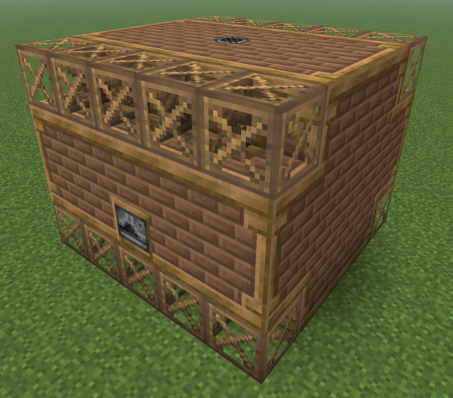

- **配方类型**: 研磨

**仓室要求**

- 蒸汽输入 1 个（必需）
- 蒸汽物品输入 1 个（必需）
- 蒸汽物品输出 1 个（必需）
- 物品输入 1 个（必需）
- 物品输出 1-3 个（必需）
- 消声仓 1 个（必需）

**相关任务**

  - [lv] 搅碎万物...吗？: 这个大家伙不仅具有32并行，而且还可以通过升级蒸汽输入仓来产出副产物

---

### 大型蒸汽破碎机

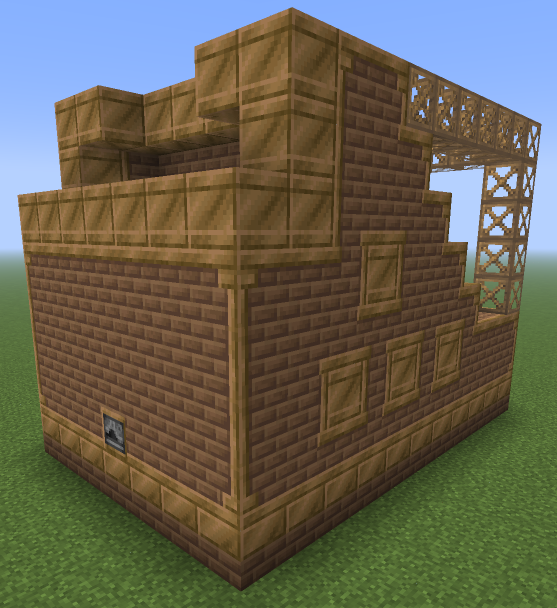

- **配方类型**: 矿石破碎

**仓室要求**

- 蒸汽输入 1 个（必需）
- 蒸汽物品输入 1 个（必需）
- 蒸汽物品输出 1-2 个（必需）
- 物品输入 1 个（必需）
- 物品输出 1-3 个（必需）

---

### 大型蒸汽离心机

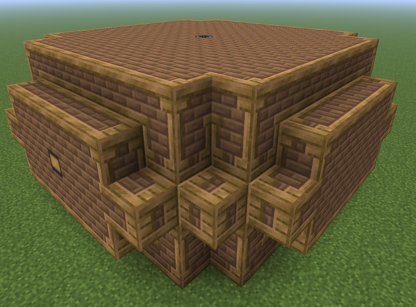

- **配方类型**: 离心

**仓室要求**

- 消声仓 1 个（必需）
- 蒸汽输入 1 个（必需）
- 蒸汽物品输入 1 个（必需）
- 蒸汽物品输出 1 个（必需）
- 蒸汽流体输入 最多 1 个（可选）
- 蒸汽流体输出 最多 1 个（可选）
- 流体输出 最多 4 个（可选）
- 流体输入 最多 1 个（可选）
- 物品输入 1 个（必需）
- 物品输出 1-4 个（必需）

---

### 大型蒸汽锻造锤

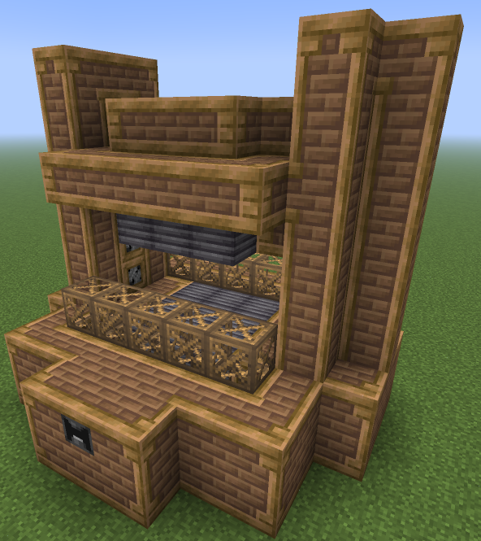

- **配方类型**: 锻锤

**仓室要求**

- 蒸汽输入 1 个（必需）
- 蒸汽物品输入 1 个（必需）
- 蒸汽物品输出 1 个（必需）
- 物品输入 1 个（必需）
- 物品输出 1 个（必需）

---

### 蒸汽分离机

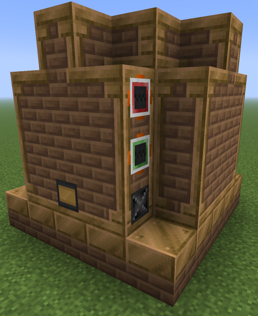

- **配方类型**: 离心

**仓室要求**

- 蒸汽输入 1 个（必需）
- 蒸汽物品输入 1 个（必需）
- 蒸汽物品输出 1-4 个（必需）
- 蒸汽流体输入 最多 1 个（可选）
- 蒸汽流体输出 最多 4 个（可选）

**相关任务**

  - [steam] 提取的产物: 你在查EMI吗？我来直接告诉你吧：你现在只能用蒸汽提取机来提取生橡胶末
  - [ulv] 正氧负氢？: 氢气可以通过离心水煤气制取
  - [ulv] 你活着都靠它: 如果你还没有造蒸汽分离机，是时候造一台了

---

### 蒸汽挤压机

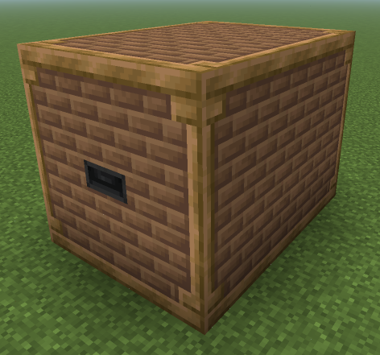

- **配方类型**: 压缩

**仓室要求**

- 蒸汽物品输入 1 个（必需）
- 蒸汽物品输出 1 个（必需）
- 蒸汽输入 1 个（必需）

---

### 蒸汽搅拌机

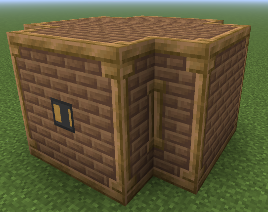

- **配方类型**: 搅拌

**仓室要求**

- 蒸汽输入 1 个（必需）
- 蒸汽物品输入 1 个（必需）
- 蒸汽物品输出 1 个（必需）

**相关任务**

  - [steam] 手动拼接？: 对的，你最开始的玻璃粉就是需要工作台手动组装

---

### 蒸汽洗矿机

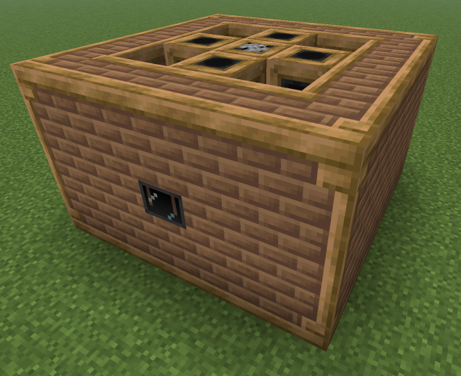

- **配方类型**: 洗矿

**仓室要求**

- 蒸汽输入 1 个（必需）
- 蒸汽物品输入 1 个（必需）
- 蒸汽物品输出 1 个（必需）
- 蒸汽流体输入 最多 1 个（可选）

---

### 蒸汽活塞锤

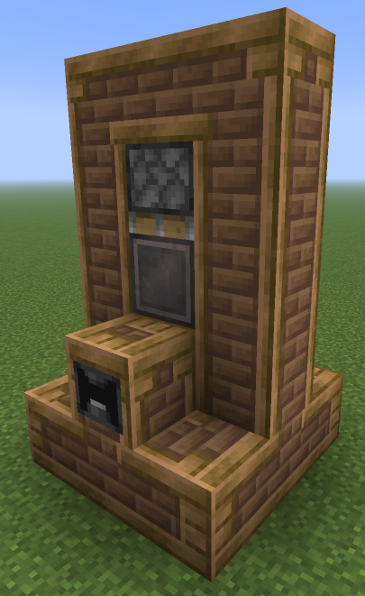

- **配方类型**: 锻锤

**仓室要求**

- 蒸汽物品输入 1 个（必需）
- 蒸汽物品输出 1 个（必需）
- 蒸汽输入（必需）

---

### 蒸汽浸洗机

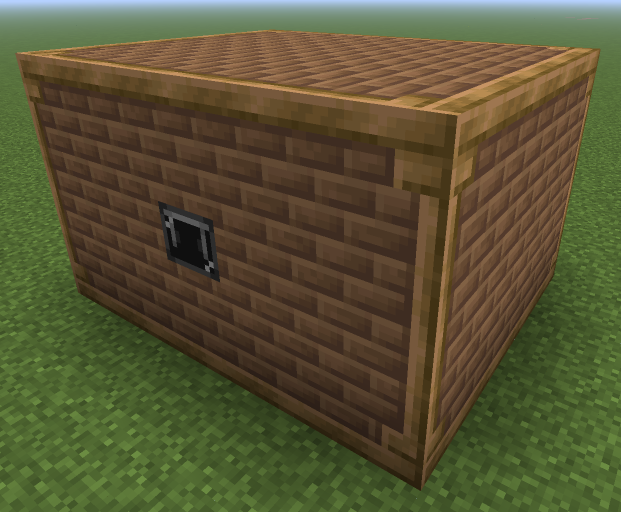

- **配方类型**: 化学浸洗

**仓室要求**

- 蒸汽输入 1 个（必需）
- 蒸汽物品输入 1 个（必需）
- 蒸汽物品输出 1 个（必需）
- 蒸汽流体输入 最多 1 个（可选）

---

### 蒸汽破碎机

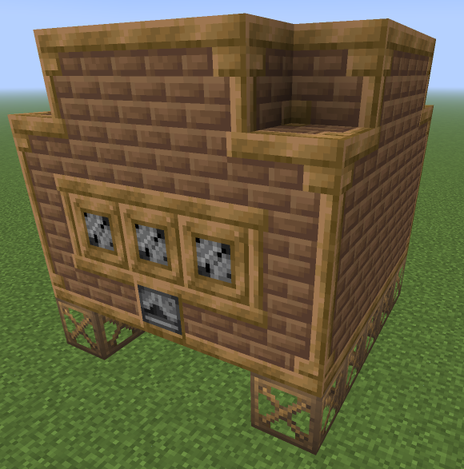

- **配方类型**: 矿石破碎

**仓室要求**

- 蒸汽输入 1 个（必需）
- 蒸汽物品输入 1 个（必需）
- 蒸汽物品输出 1-2 个（必需）

---

### 蒸汽裂化机

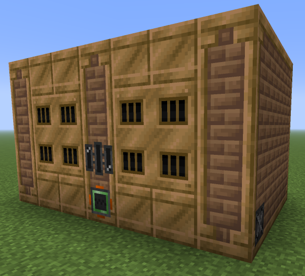

- **配方类型**: 蒸汽裂化

**仓室要求**

- 蒸汽输入 1 个（必需）
- 蒸汽流体输入 最多 2 个（可选）
- 蒸汽流体输出 最多 2 个（可选）

**相关任务**

  - [ulv] 似曾相识故人来: 蒸汽裂化机只能处理石化四种主要的中间产物（石脑油，炼油气，轻燃油，重燃油）

---

### 蒸汽铸造炉

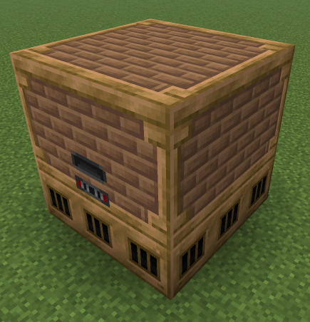

- **配方类型**: 合金熔炼

**仓室要求**

- 蒸汽输入 1 个（必需）
- 蒸汽物品输入 1-2 个（必需）
- 蒸汽物品输出 1 个（必需）

**相关任务**

  - [steam] Fusion UP!: 合金炉，将三铜一锡熔铸四个青铜锭，现在能够高效生产各种能在LV制造的合金锭

